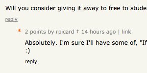

# Alter HN

I created this add on because I'd like to be able to customize certain aspects of [Hacker News](https://news.ycombinator.com).

The add-on is still in development, but right now it makes story and comment links open in a new tab.

## Current features
* Open links in new tabs
* Open comment pages in new tabs
* Distinguish link submitters in comments
* Add a link to your own submissions in the navigation
* Add an [l+c] link to submissions

## Screenshots

![Add an [l+c] link to open the link and comments in one click](screenshots/lpc-link.png)

## TODO:

See the [open issues](https://github.com/rpicard/alter-hn/issues?state=open) for a list of things to come.

## License

Copyright (c) Robert Picard

All rights reserved.

Licensed under the [MIT license](http://opensource.org/licenses/MIT).
